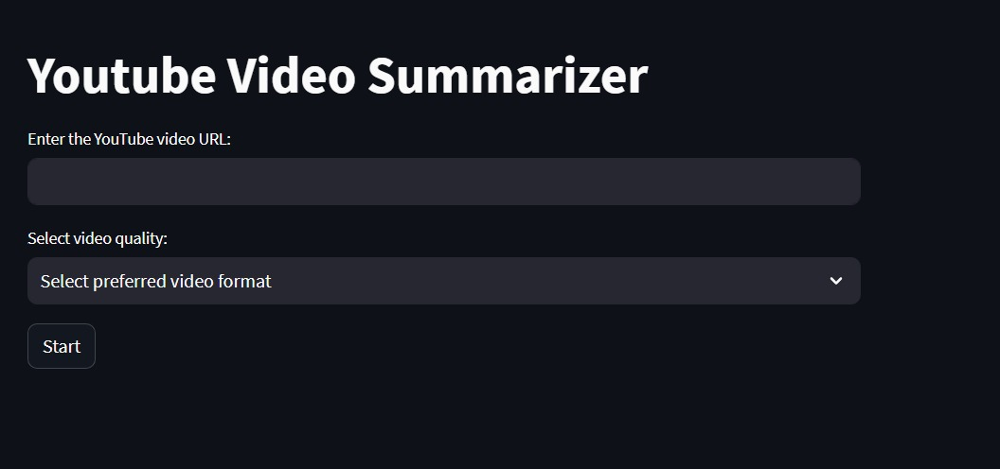

# YouTube Video Summarizer

Automated pipeline to summarize YouTube videos using Whisper for transcription and LangChain for extractive summarization. This application enables robust audio-to-text transcription of videos with Whisper and produces concise summaries using the GPT-3.5-turbo model via LangChain.



## Demo

Check out the live demo of the application [here](https://yt-video-summarize.streamlit.app/).

## Features

- **YouTube Video Input**: Accepts a YouTube video URL.
- **Video Download**: Downloads the video in the user-specified quality.
- **Transcription**: Uses the Whisper model to transcribe the video's audio.
- **Summarization**: Uses the GPT-3.5-turbo model via LangChain to generate a concise summary of the transcription.
- **Downloadable Outputs**: Provides options to download both the full transcription and the generated summary.

## Usage

1. **Setup**:
   - Clone the repository:
     ```bash
     git clone https://github.com/djpapzin/yt-video-summarizer.git
     ```
   - Navigate to the project directory:
     ```bash
     cd yt-video-summarizer
     ```
   - Install the required dependencies:
     ```bash
     pip install -r requirements.txt
     ```

2. **Environment Variables**:
   - Ensure you have set the necessary API keys in the `.env` file.

3. **Run the Application**:
   - Start the Streamlit app:
     ```bash
     streamlit run app.py
     ```

4. **User Interface**:
   - Enter a YouTube video URL.
   - Select the desired video quality.
   - Click on the "Start" button to initiate the summarization process.
   - Once processed, view and download the generated transcript and summary.

## Dependencies

- `streamlit`: For the web application interface.
- `yt-dlp`: To download YouTube videos.
- `whisper`: For audio transcription.
- `dotenv`: To load environment variables.
- `LangChain`: To communicate with the GPT-3.5-turbo model for summarization.

## Contributing

Pull requests are welcome. For major changes, please open an issue first to discuss what you would like to change.

## License

MIT